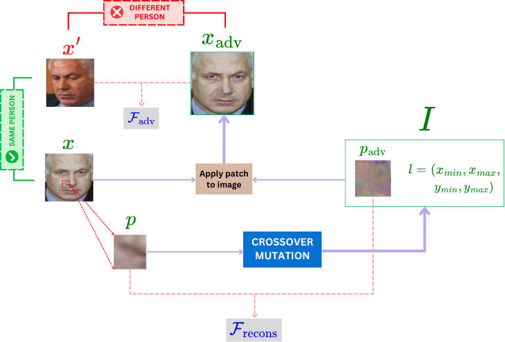
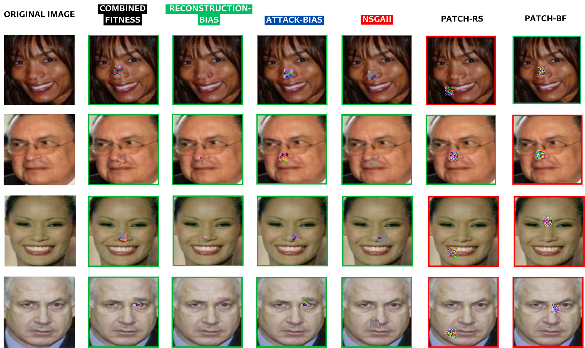

# Evolutionary Black-box Patch Attacks on Face Verification
This repository uses genetic algorithms to conduct Black-box Patch Attacks to Face Verification model.


# Propose
We propose four version of genetic algorithms with difference target: *combined-objective*, *reconstruction-bias*, *attack-bias* and *bi-objective leverage NSGAII*.



# Usage
Firstly, clone the preprocessed data and pretrained face verification model from this [Link](drive.google.com/drive/folders/1CDHDHxG9AYnGs5HHV5IfTNo1V3-YBKmb?usp=sharing).

To run the Attacks:
```cmd
cd src
python main.py --pop_size <population size> \
            --patch_size <patch width (height)> \
            --prob_mutate_location <mutation probability for location> \
            --prob_mutate_patch <mutation probability for patch> \
            --n_iter <number of iterations> \
            --tourament_size <tournament size> \
            --recons_w <reconstruction weight> \
            --attack_w <attack weight> \
            --baseline <GA | GA_flag | GA_rules | GA_sequence | NSGAII> \
            --update_location_iterval <update interval> \
            --crossover_type <UX | Blended> \
            --fitness_type <normal | adaptive> \
            --label <0 | 1> \
            --log <log path> \
            --seed <random seed>
```

# Visual Results



