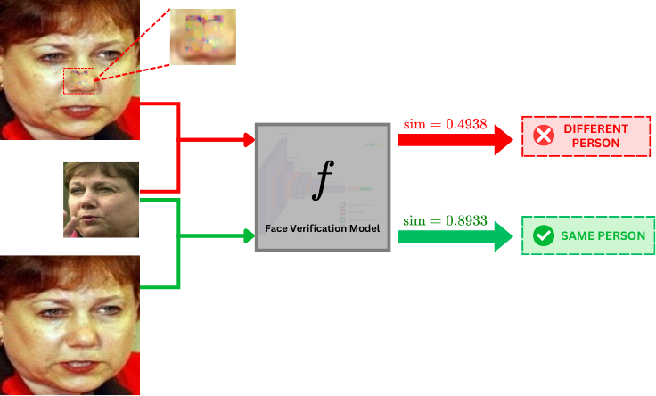

# Evolutionary Black-box Patch Attacks on Face Verification
This repository contains the official code for our poster paper, *"Evolutionary Black-box Patch Attacks on Face Verification"* accepted at GECCO 2025.



# Setup
1. Download Required Files
    - Download the LFW Dataset (contains image folder and pair annotation file) from [this link](https://vis-www.cs.umass.edu/lfw).
    - Download the Face Deep Learning Embedding Model from [this link](https://github.com/timesler/facenet-pytorch).

    The dataset's image directory should follow this structure:    
    ```LFW dataset/  
    │── Identity_Name_1/  
    │   ├── img1.png  
    │   ├── img2.png  
    │   ├── ...  
    │  
    │── Identity_Name_2/  
    │   ├── img1.png  
    │   ├── img2.png  
    │   ├── ...  
    │  
    │── ... 
    ```

2. Clone the Repository, Navigate to the Source Directory and Install the requirement packages.

    ```cmd
    $ git clone https://github.com/khoa16122004/Evolutionary-Black-box-Patch-Attacks-on-Face-Verification
    $ cd Evolutionary-Black-box-Patch-Attacks-on-Face-Verification
    $ pip install -r requirements.txt
    ``` 

# Reproducing the results
- You can reproduce the results in our paper by runing the following scripts:

    1. Attack by using Genetic Algorithm with `combined-objective` approach.
        ```cmd
        $ python main.py --pop_size 80 --patch_size 20 --prob_mutate_location 0.5 --prob_mutate_patch 0.3 --n_iter 10000 --recons_w 0.5 --attack_w 0.5 --baseline GA --fitness_type normal --seed 22520691 --pair_path <pair annotation path> --img_dir <LFW dataset directory>
        ```
    2. Attack by using Genetic Algorithm with `reconstruction-bias` approach.
        ```cmd
        $ python main.py --pop_size 80 --patch_size 20 --prob_mutate_location 0.5 --prob_mutate_patch 0.3 --n_iter 10000 --recons_w 0.5 --attack_w 0.5 --baseline GA --fitness_type adaptive --seed 22520691 --pair_path <pair annotation path> --img_dir <LFW dataset directory>
        ```

    3. Attack by using Genetic Algorithm with `attack-bias`.
        ```cmd
        $ python main.py --pop_size 80 --patch_size 20 --prob_mutate_location 0.5 --prob_mutate_patch 0.3 --n_iter 10000 --recons_w 0.5 --attack_w 0.5 --baseline GA_rules --fitness_type normal --seed 22520691 --pair_path <pair annotation path> --img_dir <LFW dataset directory>
        ```
    4. Attack by leveraging NSGA-II with `1bi-objective` approach.
        ```cmd
        $ python main.py --pop_size 80 --patch_size 20 --prob_mutate_location 0.5 --prob_mutate_patch 0.3 --n_iter 10000 --recons_w 0.5 --attack_w 0.5 --baseline NSGAII --fitness_type normal --seed 22520691 --pair_path <pair annotation path> --img_dir <LFW dataset directory>
        ```

- More details of parameters can be found in [`main.py`](https://github.com/khoa16122004/Evolutionary-Black-box-Patch-Attacks-on-Face-Verification/blob/c8339f47fda09cbc8e210c9a80110754a0afc8ce/src/main.py#L16).


<!-- # Visualization -->
<!-- Source code for results visualization can be found here [script/] -->


# Citation

If you use our source code, please cite our work as:

```bibtex
@inproceedings{phan2024mfnas,
  author       = {Khoa Tran, Linh Ly and Ngoc Hoang Luong},
  title        = {{Evolutionary Black-box Patch Attacks on Face Verification}},
  booktitle    = {GECCO '25 Companion: Proceedings of the Genetic and Evolutionary Computation Conference Companion},
  address      = {Málaga, Spain},
  publisher    = {{ACM}},
  year         = {2025}
}
```

